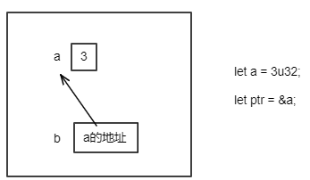

# 3.16.1 智能指针介绍

指针是一个包含了内存地址的变量，该内存地址引用或者指向了另外的数据，其在内存中的示意图如下：



智能指针是一类数据结构，其表现类似于指针，但是相对于指针来说，还拥有额外的元数据。普通引用和智能指针的另一个**非常重要的区别**就是：**引用只是只借用数据的指针，而智能指针则是拥有它们指向的数据**。

**智能指针是一个胖指针，但是胖指针不一定是智能指针**。前面章节介绍过的```String```类型就是一个智能指针，而它对应的切片引用```&str```则只仅仅是一个胖指针，区别就在于```String```类型拥有对数据的所有权，而```&str```没有。两者在内存中的示意图如下：


同样的，**Vec类型也是一个智能指针**。

智能指针通常使用结构体实现，但它不同于普通结构体的地方在于其实现了```Deref```和```Drop trait```。```Deref trait```允许智能指针结构体实例表现的像引用一样；```Drop trait```则自定义了当智能指针离开作用域时运行的代码。

总结：
- 智能指针是一个胖指针，但胖指针不一定是指针；
- 智能指针拥有对堆上数据的所有权，普通胖指针没有堆上数据的所有权；
- 智能指针实现了```Deref trait```和```Drop trait```，前者用来让智能指针表现的像引用，后者用来实现离开作用域时的代码；
- 前面接触过的类型中，```String```和```Vec```类型本质都是智能指针。
